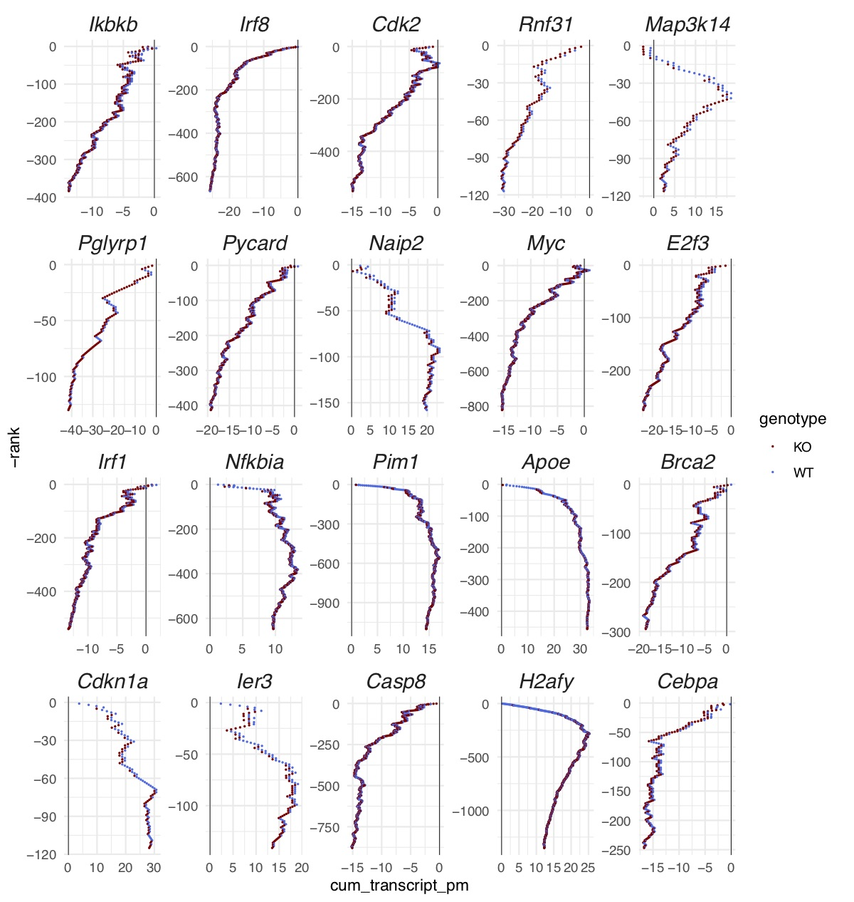
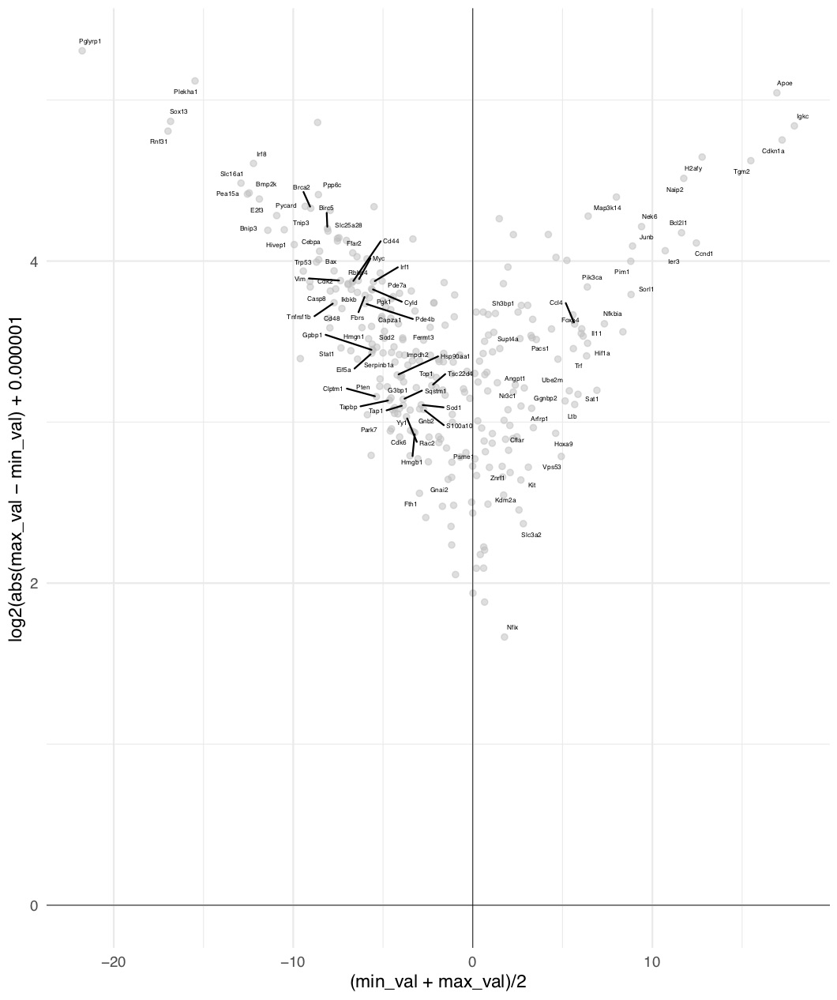

# Gene_rankings

### Method to estimate tendencies of gene expression levels in two groups.

Differentially expressed genes are often found using methods for differential gene expression analysis like DESeq2.
Certain genes might show very low gene expression, gene expression gradients or gene expression in a subgroup of a group of interest.
These genes might not always be picked up by differential gene expression analysis and might need a different way to 
assess potential differences in 2 populations in single cell data, that could be relevant to biological research.

This code represents an experimental idea on how to measure subtle differences in single cell data for 2 groups.

1. Genes of interested (e.g. NFkB targets) and the 2 cell populations (e.g. group1 (wt) and group2 (ko) ) are selected
2. Every gene is ranked from highest to lowest.
3. The expression values for one group are multiplied by -1 (e.g. group2) 
5. Cumulative sums of the ranked and modified expression values can be calculated and plotted.
6. Minimal and maximal values for the cumulative sums are calculated
7. 1000 random permutations of the rank orders are performed to estimate the minimal and maximal values, that could be obtained by chance. This is used to calculate a p-value.

This allows to estimate whether a certain group is preferentially among the top ranked cells.
The inclusion of gene expression and not only the rank gives more weight to cells that actually express gene transcripts vs. cells that have no or very low expression.

### Plot showing cumulative sums

Rank is shown on the y-axis and a normalized cumulative sum of expression values on the x-axis

### Plot of min and max values for the described procedure. Significant NFkB target genes are shown.

